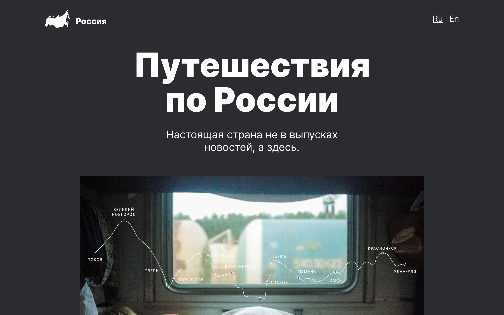

<h1 align="center">Проект: Путешествие по России</h1>
<h2 align="center">Проектная работа в рамках обучения на Я.Практикуме</h2>

<h2 align="center"> Используемые технологии &#128187;</h2>

- HTML
- CSS
- Grid Layout
- Flexbox
- Адаптивная верстка

<h2 align="center">Описание проекта &#128444</h2>

Проект представляет собой визиализацию поездки на поезде по России, посещение различных значимых мест, получение о них интересной информации.
На странице можно почитать краткую информацию о некоторых местах, а также перейти на страницы значимых мест путеществия на различных платформах.

<h3 align="center">Данная проектная работа включает в себя:</h3>

* адаптацию блоков и элементов страницы под различные разрешения (большие экраны, планшеты, мобильные телефоны);
* использование функций грид-блока и грид-элементов;
* работа содержит реальные ссылки на страницы;
* имется возможность перейти на сервисы яндекса для получения дальнейшей информации;
* возможность переключения языка на английский;

<h2 align="center"> Инструкция по развертыванию &#128212;</h2>

Хотите попробовать в использовании данный ресурс?

1. Клонируйте данный репозиторий локально
2. Откройте в браузере файл index.html в корневой папке проекта или перейдите по данной ссылке [&#128073;&#128161;](https://mariarez.github.io/russian-travel/index.html)
3. Наслаждайтесь &#127881;

<h2 align="center"> Планы по доработке проекта &#128221; </h2>

- Изменить язык страницы и наименование;
- Сделать дополнительные контрольные точки для лучшего отображения;
- В секции lead для группировки картинки и подписи к ней использовать тег figure и figcaption;
- Изображения в photo-grid для улучшения семантики выделить в список ul. Не забыит убрать стандартные стили: margin, padding, list-style-type;
- В place вместо div использовать тег article;
- В шапке сайта применить transition для основного селектора, эффект будет работать при снятии курсора и при его наведении;

<h2 align="center"> Дополнительная информация &#128222;</h2>

- [Ссылка на макет в Figma](https://www.figma.com/file/5S2WSbEFL6awjVWJ0NWL8Q/Sprint-3_-Russia-_-desktop-mobile?node-id=28503%3A0)
- [Ссылка на проектную работу](https://mariarez.github.io/russian-travel/index.html)